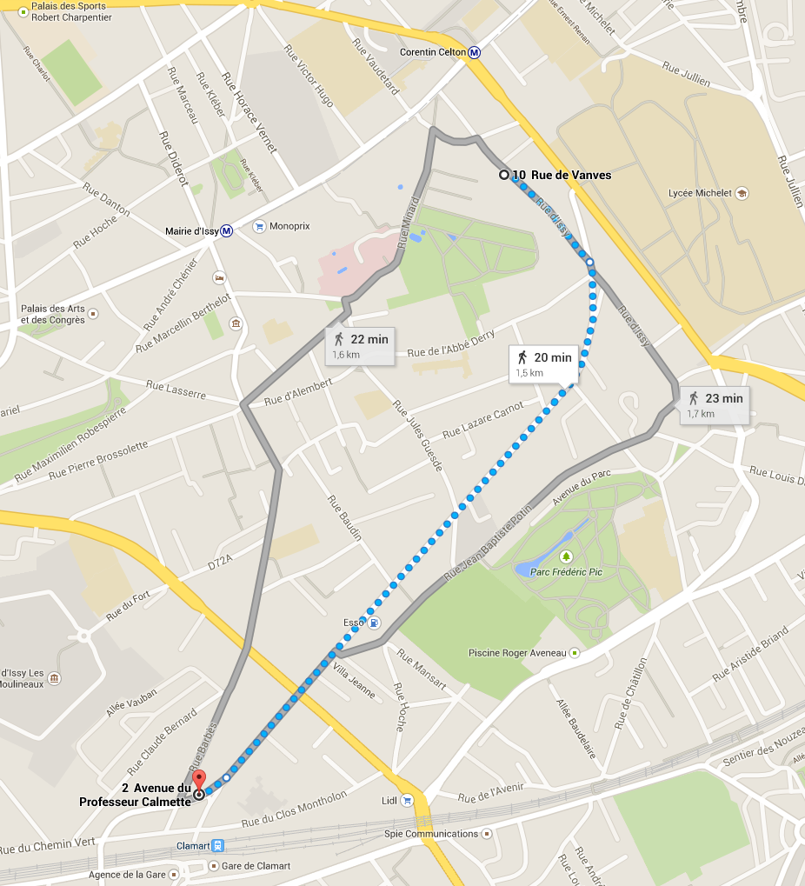

# Description of 2, avenue du Professeur Calmette 

I've found that accommodation on Isep internal website to help student to get affordable accommodation. This could be the cheapest room in Paris, I've never seen such similar rooms so cheap.

* Location: 2 Av du Professeur Calmette, 92130 Issy-les-Moulineaux. It's not in City of Paris itself but in an adjoining city. It's in the same city as Isep.
* The landlord is a woman, probably an old one and the borough is quiet so you have no safety issue
* Landlord want to make sure she will rent this rooom to a pleasant, polite people who will pay each month.
* It's 12 square metres. Restrooms and private bathroom are not in the room itself. (to be confirmed)
* Monthly rental is €160, including lunch five days a week.
* In the advertisement, landlord says it's OK for exchange student.

Here is map of the surrounding with path from this room to Isep. It lasts 20 minutes by walk. You can see you're quite close to underground station (it's blue circled M).

